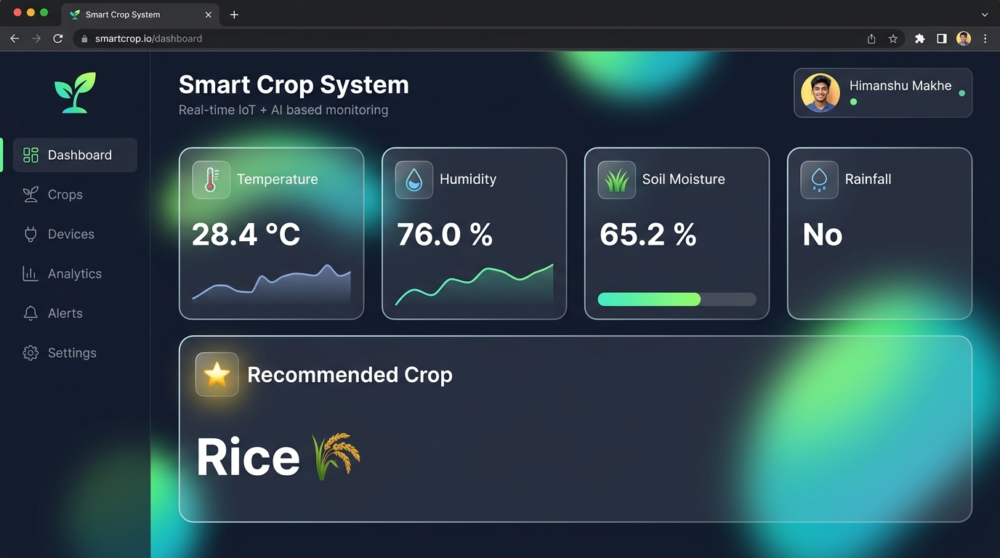
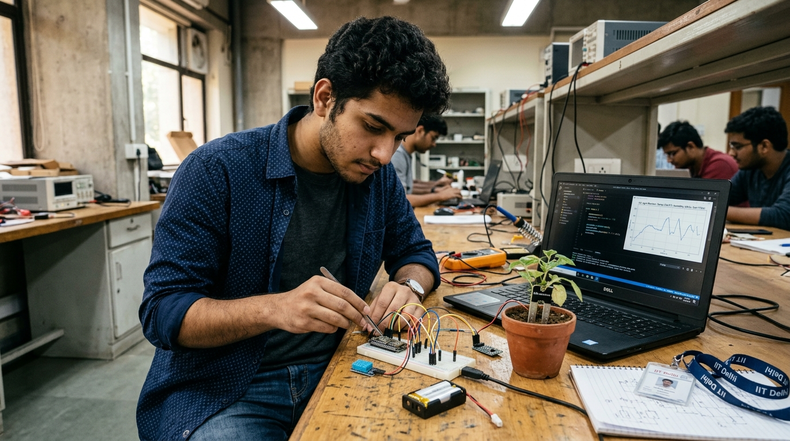
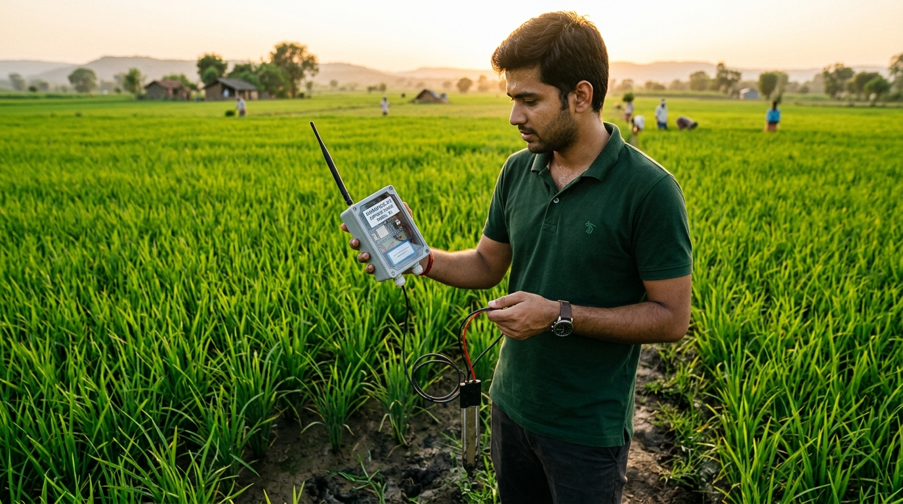
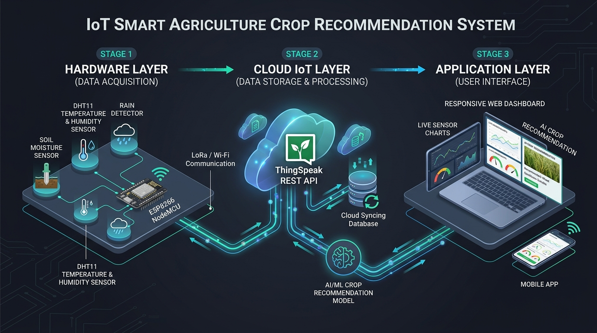

# 🌾 Smart Crop Recommendation System (IoT + Cloud)

[](https://opensource.org/licenses/MIT)
[](https://www.espressif.com/)
[](https://thingspeak.com/)
[](#-dashboard-interface)
[](https://github.com/paras999000/crop-recommendation-system/pulls)

An end-to-end **Smart Agriculture & Precision Farming System** that collects real-time environmental metrics (Temperature, Humidity, Soil Moisture, Rainfall) through **ESP8266**, streams telemetric data to **ThingSpeak Cloud**, evaluates soil and climate parameters with an automated agronomic recommendation algorithm, and renders live analytics on an interactive, glassmorphic **Web Dashboard**.

---

## 📸 Project Showcase

### 🖥️ Dashboard Interface
The web client features real-time data polling, status animations, and dynamic crop recommendations wrapped in a modern glassmorphic interface:



---

### 🛠️ Hardware Prototype & Lab Testing
The sensor node prototype built with an ESP8266 NodeMCU development board, DHT sensor, capacitive soil moisture probe, and rain detection module being tested in the electronics lab:



---

### 🌾 Field Deployment & Farm Testing
On-site agricultural testing of the portable IoT crop telemetry node deployed in a paddy farm:



---

### 🌐 End-to-End System Architecture
Data transmission and processing pipeline across the Hardware, Cloud, and Application layers:



---

## 🌟 Key Features

- **Real-Time Telemetry**: Gathers live readings for ambient temperature (°C), relative humidity (%), volumetric soil moisture (%), and precipitation detection.
- **Rule-Based Agronomic Engine**: Real-time evaluation of climatic and edaphic conditions to recommend the optimal crop for maximum yield.
- **Cloud IoT Streaming**: Seamless telemetry ingestion and time-series logging via ThingSpeak REST APIs.
- **Ultra-Responsive Web Dashboard**: Built with vanilla HTML5, CSS3, and JavaScript, featuring glassmorphism cards, ambient reactive glows, and micro-animations.
- **Auto-Recovery & Error Handling**: Graceful fallback UI indicators for network outages or delayed cloud telemetry.

---

## 📊 Sensor & Crop Logic Matrix

The embedded controller continuously assesses ambient metrics against the following agronomic parameter matrix:

| Recommended Crop | Temperature Range | Humidity Range | Soil Moisture | Rainfall Status |
| :--- | :--- | :--- | :--- | :--- |
| **Rice 🌾** | > 25 °C | > 70 % | > 70 % | No Rain (0) |
| **Sugarcane 🍬** | 20 °C – 30 °C | > 60 % | > 50 % | Any |
| **Wheat 🌿** | 15 °C – 25 °C | Any | 40 % – 70 % | Any |
| **Cotton 🌱** | > 30 °C | < 50 % | < 40 % | Any |
| **Maize 🌽** | Any | > 60 % | > 30 % | Any |
| **Paddy 🌾** | > 20 °C | > 50 % | Any | No Rain (0) |
| **Barley 🌾** | > 18 °C | > 65 % | > 35 % | Any |
| **Millet 🌾** | > 25 °C | < 60 % | > 30 % | Any |
| **Soybean 🌿** | > 22 °C | > 55 % | > 45 % | Any |

---

## 🔌 Hardware Components & Pinout

### Bill of Materials (BOM)
1. **ESP8266 NodeMCU** (Wi-Fi Microcontroller)
2. **DHT11 / DHT22** (Temperature & Relative Humidity Sensor)
3. **Soil Moisture Sensor Probe** (Capacitive or Resistive)
4. **Raindrop / Precipitation Detection Module**
5. **Solderless Breadboard & DuPont Jumper Wires**
6. **Micro-USB Power Supply** (5V / 1A)

### Recommended Pin Configuration
| Component | Sensor Pin | ESP8266 NodeMCU Pin |
| :--- | :--- | :--- |
| **DHT11 / DHT22** | DATA | `D4` (GPIO2) |
| **Soil Moisture Sensor** | ANALOG OUT (A0) | `A0` (ADC0) |
| **Rain Detection Module** | DIGITAL OUT (D0) | `D2` (GPIO4) |
| **VCC (All Sensors)** | VCC / + | `3V3` or `VIN` |
| **GND (All Sensors)** | GND / - | `GND` |

---

## 📡 Cloud API (ThingSpeak) Data Mapping

The IoT node dispatches telemetry to ThingSpeak channels using HTTP `GET` requests:

```http
GET https://api.thingspeak.com/update?api_key=YOUR_WRITE_API_KEY&field1=TEMP&field2=HUMIDITY&field3=SOIL&field4=RAIN&field5=CROP
```

| Field ID | Parameter | Data Type | Unit / Representation |
| :--- | :--- | :--- | :--- |
| `field1` | Temperature | Float | °C |
| `field2` | Relative Humidity | Float | % |
| `field3` | Soil Moisture | Integer / Float | % |
| `field4` | Rainfall | Binary (0 / 1) | 0 = No Rain, 1 = Raining |
| `field5` | Recommended Crop | String | Predicted crop name + emoji |

---

## 🚀 Getting Started

### 1. Embedded Firmware Setup (Arduino IDE)
1. Open the [Arduino IDE](https://www.arduino.cc/en/software).
2. Install the **ESP8266 Board Package**:
   - Go to `File` > `Preferences`.
   - Add this URL to *Additional Boards Manager URLs*:
     ```text
     http://arduino.esp8266.com/stable/package_esp8266com_index.json
     ```
   - Go to `Tools` > `Board` > `Boards Manager`, search for `ESP8266`, and click **Install**.
3. Open the firmware sketch located at [`sketch_mar23a/sketch_mar23a.ino`](sketch_mar23a/sketch_mar23a.ino).
4. Update your Wi-Fi credentials and ThingSpeak Write API key:
   ```cpp
   const char* ssid = "YOUR_WIFI_SSID";
   const char* password = "YOUR_WIFI_PASSWORD";
   String apiKey = "YOUR_THINGSPEAK_WRITE_API_KEY";
   ```
5. Select your board (`NodeMCU 1.0 (ESP-12E Module)`) and port, then click **Upload**.

---

### 2. Web Dashboard Deployment
No build steps or complex dependencies required!

1. Open [`script.js`](script.js) and ensure your ThingSpeak Channel ID and Read API Key are configured:
   ```javascript
   const THINGSPEAK_URL = "https://api.thingspeak.com/channels/YOUR_CHANNEL_ID/feeds/last.json?api_key=YOUR_READ_API_KEY";
   ```
2. Launch the application:
   - Double-click [`index.html`](index.html) to open it in any modern web browser (Edge, Chrome, Firefox, Safari).
   - Or serve locally using Python:
     ```bash
     python -m http.server 8080
     ```
     Navigate to `http://localhost:8080`.

---

## 📂 Repository File Structure

```text
crop-recommendation-system/
├── assets/
│   ├── dashboard_preview.png    # Live web UI preview screenshot
│   ├── hardware_setup.png       # Real IoT hardware prototype & lab photo
│   ├── field_testing.png        # Agricultural field deployment photo
│   └── system_architecture.png  # End-to-end data flow and architecture
├── sketch_mar23a/
│   ├── main.kcl                 # Modeling & configuration settings
│   └── sketch_mar23a.ino        # ESP8266 Arduino firmware & decision engine
├── .gitignore                   # Ignored files and system artifacts
├── index.html                   # Glassmorphic web dashboard UI
├── script.js                    # Live ThingSpeak polling & UI animator
├── style.css                    # Modern CSS design tokens, cards, and animations
└── README.md                    # Project documentation
```

---

## 🔮 Future Enhancements

- [ ] **Machine Learning Integration**: Upgrade rule-based logic to a trained Random Forest / XGBoost model hosted on an edge API.
- [ ] **Automated Irrigation**: Add relay module control to trigger water pumps automatically when soil moisture dips below critical thresholds.
- [ ] **Push Notifications**: Integrate Twilio or Telegram Bot API to dispatch SMS alerts to farmers.
- [ ] **Historical Analytics**: Add interactive Chart.js graphs to view 7-day temperature and soil moisture trends.

---

## 📄 License

This project is licensed under the [MIT License](LICENSE). Feel free to use, modify, and distribute it for personal, academic, or commercial applications.
